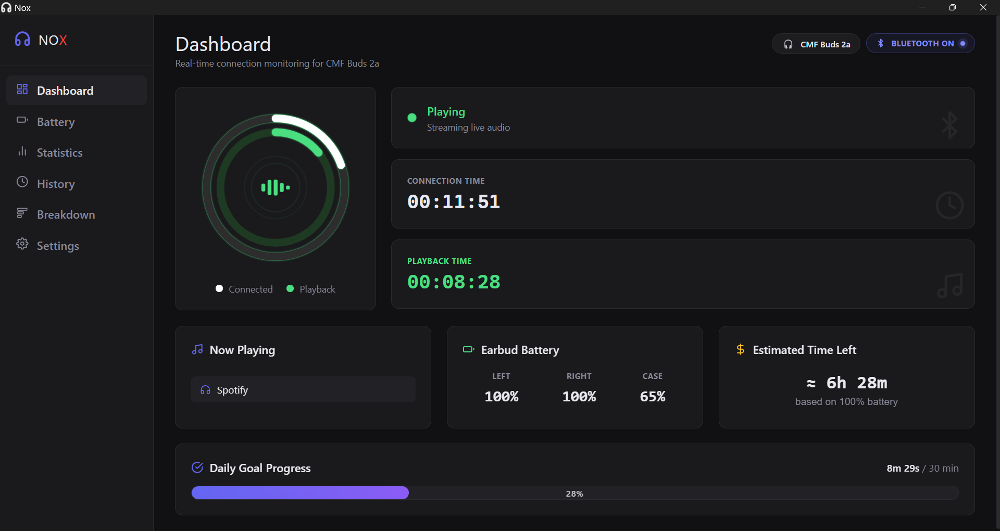
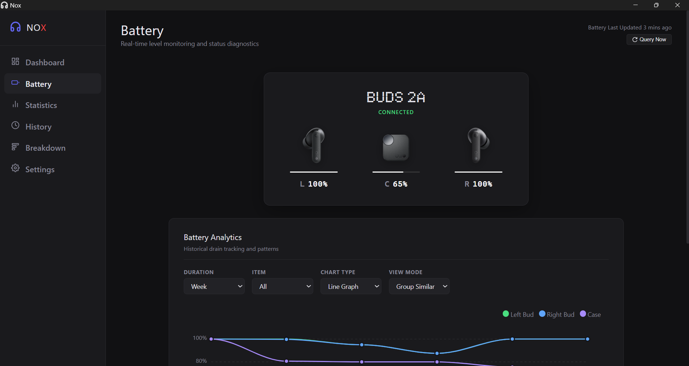
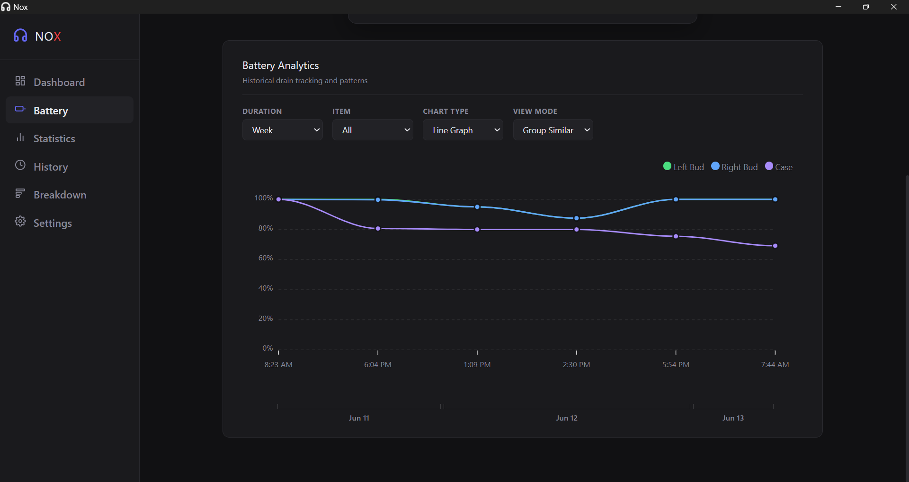
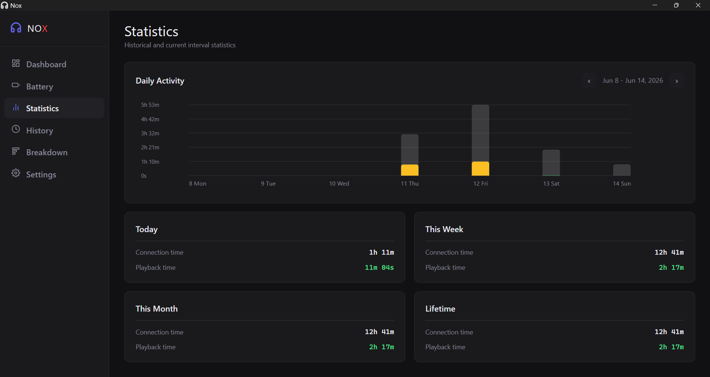
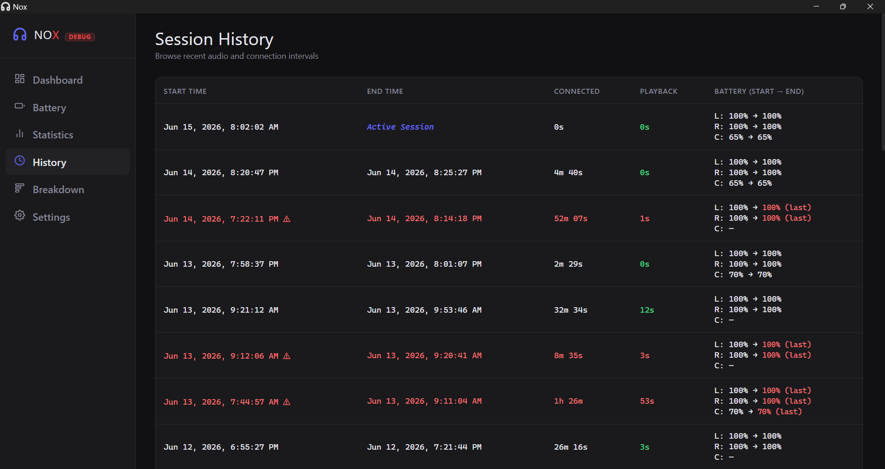
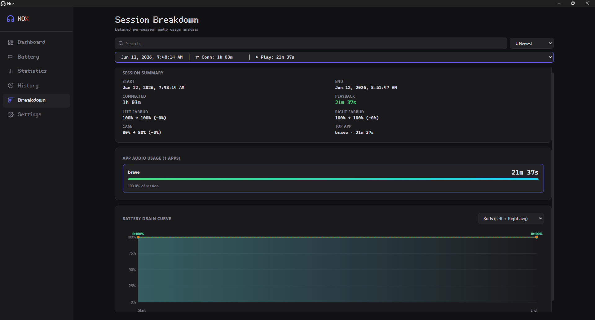
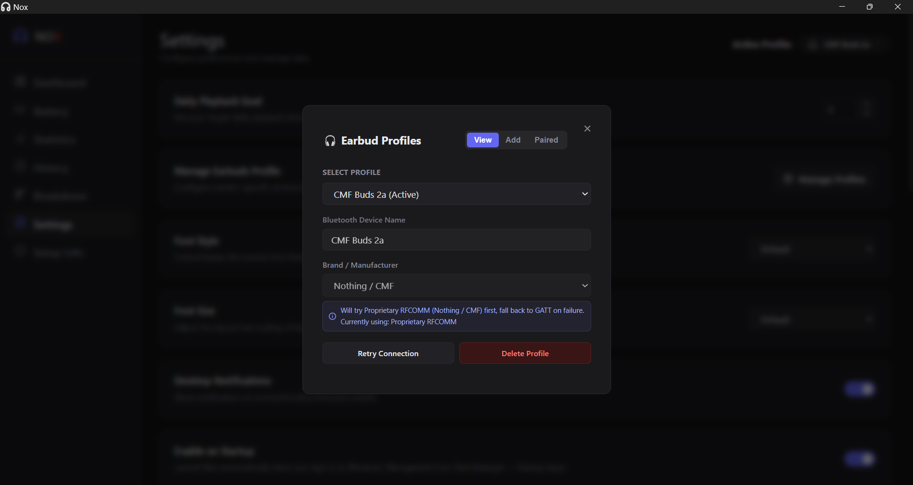
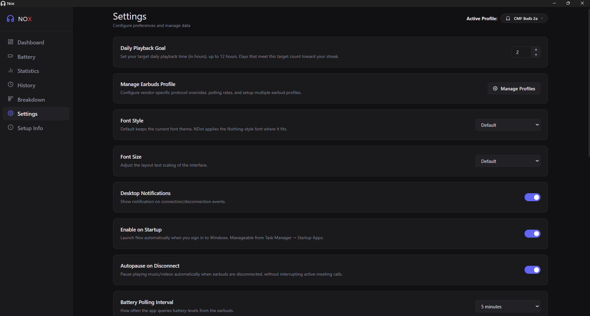
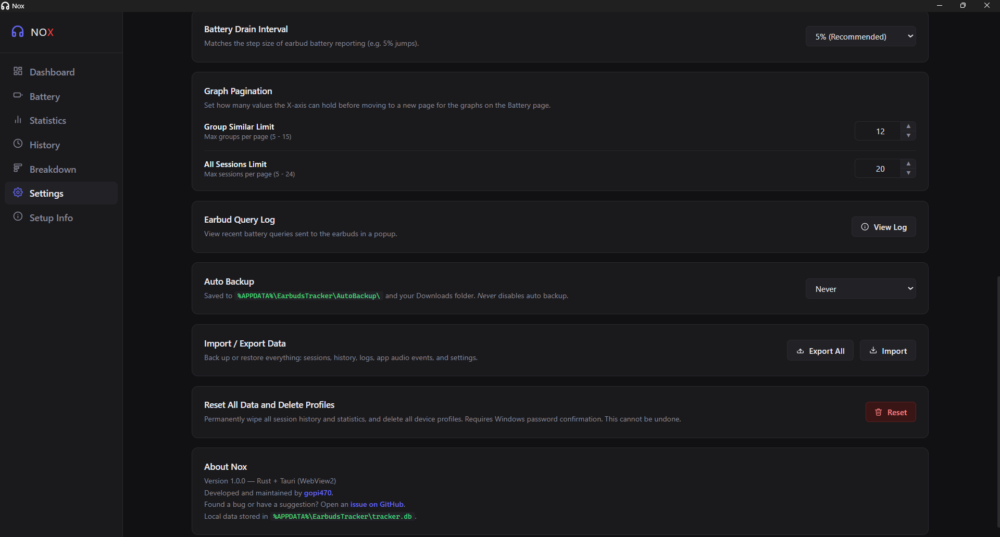

# Nox

A lightweight Windows background tracking utility and desktop dashboard for monitoring connection time, active media playback duration, and battery levels for Bluetooth earbuds.

Designed as a tracker supporting custom profile creation for **most Bluetooth earbuds** (via standard GATT battery service, SPP protocols, and custom UUIDs), with out-of-the-box support and optimized profiles for **Nothing** and **CMF** devices (like the **CMF Buds 2a**). Built using **Rust**, **Tauri (v2)**, and **SQLite**.



---

## Installation

Download the latest Windows installer from:

- [Latest GitHub Release](https://github.com/gopi470/Nox/releases/latest)

On the release page, look in the **Assets** section for the `.msi` or `.exe` installer.

---
## Note

> **Security Warning**: As an unsigned, low-distribution utility, newly released builds of Nox may trigger generic SmartScreen/antivirus warnings (e.g., `Trojan:Win32/Bearfoos.A!ml`). If flagged by Windows Defender, select **Allow on device** under *Protection history* in Windows Security. For SmartScreen blocks, click **More info** -> **Run anyway**.
>
> For more details on why Windows Defender flags unsigned Tauri binaries, see this [Tauri GitHub issue on antivirus false positives](https://github.com/tauri-apps/tauri/issues/2486).

---

## Interface Showcase

<table width="100%">
  <tr>
    <td width="50%" align="center">
      <b>Battery History & Telemetry (SPP Mode)</b><br/>
      
    </td>
    <td width="50%" align="center">
      <b>Battery History & Telemetry (GATT Mode)</b><br/>
      
    </td>
  </tr>
  <tr>
    <td width="50%" align="center">
      <b>Statistics & Analytics Dashboard</b><br/>
      
    </td>
    <td width="50%" align="center">
      <b>Session History Logs</b><br/>
      
    </td>
  </tr>
  <tr>
    <td width="50%" align="center">
      <b>Session Breakdown Details</b><br/>
      
    </td>
    <td width="50%" align="center">
      <b>Manage Profile Settings</b><br/>
      
    </td>
  </tr>
  <tr>
    <td width="50%" align="center">
      <b>General Settings</b><br/>
      
    </td>
    <td width="50%" align="center">
      <b>Advanced Settings</b><br/>
      
    </td>
  </tr>
</table>

---

## Key Features

- **Custom Earbud Profiles**: Create and switch custom profiles for most Bluetooth earbuds with vendor-specific protocol overrides (GATT vs. SPP).
- **MAC Address Binding**: Binds profiles to unique Bluetooth hardware MAC addresses to prevent profile collision.
- **Real-Time Telemetry**: Left/Right earbud & case battery percentages and charging states (via WinRT RFCOMM socket SPP or standard GATT BAS).
- **Automatic Protocol Probing**: Auto-detects RFCOMM SPP vs. GATT capabilities on first connection and persists the chosen mode to bypass subsequent probing.
- **Background Tracking**: Silent connection presence and media playback monitoring via WASAPI peak meters (250ms polling, 2s silence grace filter).
- **Universal Autopause**: Instantaneously pauses all active media (Spotify, Chrome/Edge, VLC, etc.) via WinRT SMTC upon earbud disconnection.
- **Audio App Attribution**: Logs exact foreground process names generating audio playback during active tracking sessions.
- **Interactive Analytics**: Daily usage rings, listening streak tracking, dynamic battery drain line charts, and hardware Bluetooth radio status badge.
- **Session History & Exports**: Detailed logs with user-editable notes, per-app breakdown lists, and CSV/JSON exporting.
- **Diagnostics Query Logger**: Real-time event logger showing detailed request/response diagnostic timestamps and protocol logs.
- **Custom Auto-Backup Schedule**: Configurable hourly scheduler for database exports (daily, weekly, monthly, or on startup) to `Downloads`.
- **Security & Tray Control**: Singleton instance locking to prevent duplicate processes, close-to-tray execution, and password-protected data resets.

---


## Architecture Overview

Nox operates as a lightweight, dual-process desktop utility designed to run continuously and silently in the background:

```
                   ┌──────────────────────────────────┐
                   │        Tauri Rust Backend        │
                   │      (earbuds-tracker.exe)       │
                   └──────┬────────────────────▲──────┘
                          │                    │
            Tauri Events  │                    │ Tauri Commands
            (IPC push)    │                    │ (IPC request)
                          ▼                    │
                   ┌───────────────────────────┴──────┐
                   │       HTML5 / CSS / JS UI        │
                   │         (Tauri WebView2)         │
                   └──────────────────────────────────┘
```

### 1. **Tauri Backend (Rust)**
Runs silently as a background service:
- **Presence & Connection Monitoring**: Tracks the connection/disconnection state of paired Bluetooth devices using an optimized 500ms polling interval. Combines low-overhead active WASAPI endpoint scanning with throttled PnP checks (every 3 seconds) for a zero-CPU footprint.
- **Audio Session Tracker**: Monitored via Windows WASAPI session peak meters to measure active playback time. Polling is done every 250ms, with 500ms start activation and a 2-second silence grace filter.
- **Battery Polling Service**: Runs a background polling thread that connects to earbuds via WinRT RFCOMM socket SPP or GATT direct services, caching battery stats periodically.
- **Universal Autopause**: Automatically executes concurrent WinRT SMTC pause commands to all active media applications (falling back to a virtual key event) when a device disconnect is detected.
- **Database Engine**: Embeds an SQLite database to record session telemetry, process-specific audio usage, and daily logs.
- **Auto-Backup Engine**: Automatically schedules database exports to JSON files inside `exports/` and the user's `Downloads/` directory.

### 2. **Frontend Dashboard (HTML/CSS/JS)**
A modern dark-themed WebView2 interface accessed from the system tray:
- **Dynamic Renderers**: Renders daily usage stats using SVG/Canvas dual-ring meters and animated audio equalizers.
- **Battery & Connection Analytics**: Displays historical graphs via ApexCharts.
- **Dynamic Pagination**: Performs date-aware bin-packing calculations in JavaScript to slice large datasets into readable chunks.
- **Local Persistence**: Saves UI configuration preferences inside the browser's `localStorage`.

---

## Project Structure

```
├── test_winrt.ps1             # WinRT Bluetooth prototyping script
├── test.ps1                   # PnP device battery prototyping script
└── earbuds-tracker-tauri/     # Tauri Project root
    ├── src/                   # Frontend assets
    │   ├── index.html         # Core dashboard interface
    │   ├── styles.css         # Styling, themes, animations, layouts
    │   ├── main.js            # Frontend logic, database calls, graph rendering
    │   └── utils.js           # Utility and helper functions
    └── src-tauri/             # Rust source code
        ├── src/
        │   ├── main.rs        # Tauri entrypoint
        │   ├── lib.rs         # Commands and tray setup
        │   ├── app_audio.rs   # Audio process tracking and autopause features
        │   ├── audio.rs       # WASAPI peak audio monitoring
        │   ├── bluetooth.rs   # Audio/PnP connection detection
        │   ├── db.rs          # SQLite migrations and querying
        │   ├── spp.rs         # Serial port protocol for battery stats
        │   └── tracker.rs     # Core session state driver
        └── Cargo.toml         # Rust backend dependencies
```

---

## Developer Installation & Setup

### Prerequisites
1. **Windows 10 / 11**
2. **Node.js** (for Tauri frontend tooling)
3. **Rust and Cargo** toolchain

### Build & Run
1. Clone the repository:
   ```bash
   git clone https://github.com/gopi470/Nox.git
   cd Nox
   ```
2. Navigate to the Tauri project directory, install dependencies, and start development mode:
   ```bash
   cd earbuds-tracker-tauri
   npm install
   npm run tauri dev
   ```
3. To compile a production build:
   ```bash
   npm run tauri build
   ```
   After the build finishes, look in the Tauri output folder for the generated installer or package. The exact path depends on the target format you build, but it is typically under `src-tauri/target/release/bundle/`.

---

## Configuration Details

All application files are stored in the user's local AppData directory (`%APPDATA%\EarbudsTracker\`):

- **`tracker.db`**: Local SQLite database storing session history, audio peaks, and daily usage statistics.
- **`settings.json`**: Global configurations (device names, intervals, battery step size, notifications, and autostart).
- **`auto_backup_state.json`**: Tracking details for the automated hourly backup scheduler.
- **Browser `localStorage`**: Persists client-side UI preferences (graph pagination, goals, and font sizing) for instant loads.


---

## License & Legal

This project is licensed under the terms of the GNU General Public License v3.0 (GPL-3.0). See the [LICENSE](LICENSE) file for the full license text.

This project is not affiliated with, sponsored by, or endorsed by **Nothing Technology Limited** or **CMF**. All brand names, logos, and trademarks are the property of their respective owners.
